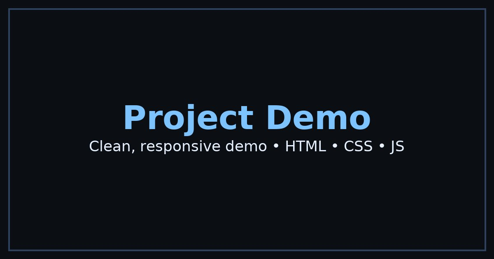

# Pulse Analytics Dashboard

A modern, responsive analytics dashboard built with vanilla HTML, CSS, and JavaScript. Features a dark theme, interactive charts, sortable tables, and mobile-first design.



## ✨ Features

### 🎨 Design & UX
- **Dark Theme**: Modern dark color scheme with CSS custom properties
- **Responsive Design**: Mobile-first approach, works on all screen sizes
- **Accessibility**: WCAG compliant with proper landmarks, focus management, and ARIA labels
- **Modern UI**: Clean, professional interface with smooth animations

### 📊 Analytics Components
- **Summary Cards**: Revenue, Orders, Active Users, Conversion with trend indicators
- **Interactive Charts**: Line chart (Revenue Trend) and Bar chart (Orders by Category) using Chart.js
- **Data Table**: Sortable, searchable orders table with pagination
- **Real-time Updates**: Mock data that simulates live analytics

### 🔧 Functionality
- **Mock Login**: Demo authentication flow (no real auth)
- **Responsive Sidebar**: Collapsible navigation on mobile devices
- **Table Features**:
  - Column sorting (click headers to sort)
  - Search filtering across all columns
  - Client-side pagination (10 items per page)
  - Empty state handling
- **Chart Integration**: Chart.js via CDN with custom dark theme styling

### ♿ Accessibility Features
- Skip to content link
- Proper semantic HTML structure
- ARIA labels and roles
- Keyboard navigation support
- Focus-visible styles
- Screen reader friendly

### 📱 Mobile Optimized
- Touch-friendly interface
- Responsive grid layouts
- Mobile hamburger menu
- Optimized for 360px+ screen widths

## 🚀 Quick Start

### Prerequisites
- Modern web browser (Chrome, Firefox, Safari, Edge)
- Local web server (optional, for development)

### Local Development

1. **Clone or download** the project files
2. **Open** `index.html` in your browser, or
3. **Serve locally** using any of these methods:

```bash
# Using Python 3
python -m http.server 8000

# Using Node.js (if you have http-server installed)
npx http-server

# Using PHP
php -S localhost:8000
```

4. **Visit** `http://localhost:8000` in your browser
5. **Login** with any email/password (demo mode)

### Demo Credentials
- **Email**: `admin@pulse.com` (or any email)
- **Password**: `password` (or any password)

## 📁 Project Structure

```
pulse-analytics/
├── index.html          # Main HTML file
├── styles.css          # CSS styles and dark theme
├── script.js           # JavaScript functionality
├── og-image.jpg        # Open Graph preview image
├── favicon.ico         # Site favicon
├── robots.txt          # Search engine directives
├── sitemap.xml         # Site structure for SEO
├── netlify.toml        # Netlify deployment config
├── vercel.json         # Vercel deployment config
└── README.md           # This file
```

## 🎯 Lighthouse Targets

The dashboard is optimized to achieve these Lighthouse scores:

- **Performance**: ≥90
- **Accessibility**: ≥95
- **Best Practices**: ≥90
- **SEO**: ≥90

### Performance Optimizations
- Deferred JavaScript loading
- Optimized images (<200KB)
- Minimal CSS/JS bundle sizes
- Efficient DOM manipulation
- Lazy loading where applicable

### Accessibility Improvements
- Semantic HTML structure
- Proper heading hierarchy
- ARIA labels and roles
- Keyboard navigation
- Color contrast compliance
- Screen reader compatibility

## 🚀 Deployment

### Netlify Deployment

1. **Connect** your repository to Netlify
2. **Build settings**:
   - Build command: (leave empty - static site)
   - Publish directory: `/` (root)
3. **Deploy** automatically on git push

The `netlify.toml` file is pre-configured for optimal performance.

### Vercel Deployment

1. **Import** your repository to Vercel
2. **Framework preset**: Other
3. **Build settings**: (auto-detected)
4. **Deploy** automatically on git push

The `vercel.json` file is pre-configured for static hosting.

### Manual Deployment

Upload all files to any static hosting service:
- GitHub Pages
- AWS S3
- Google Cloud Storage
- Any web server

## 🛠️ Customization

### Colors & Theme
Modify CSS custom properties in `styles.css`:

```css
:root {
    --bg: #0b0f14;        /* Background */
    --panel: #111826;     /* Panel backgrounds */
    --text: #e6f0ff;      /* Primary text */
    --muted: #9fb3d1;     /* Secondary text */
    --border: #1e2a3b;    /* Borders */
    --accent: #7cc3ff;    /* Accent color */
}
```

### Data & Charts
Update mock data in `script.js`:

```javascript
// Modify chart data
const revenueData = {
    labels: ['Jan', 'Feb', 'Mar', ...],
    datasets: [{
        data: [85000, 92000, 88000, ...],
        // ... other properties
    }]
};

// Modify table data
const mockOrders = [
    { id: 'ORD-001', customer: 'John Smith', ... },
    // ... more orders
];
```

### Adding New Features
- **New Charts**: Add Chart.js configurations in `initializeCharts()`
- **New Tables**: Extend the table structure and add sorting logic
- **New Pages**: Add navigation items and corresponding content sections

## 🔧 Browser Support

- **Chrome**: 90+
- **Firefox**: 88+
- **Safari**: 14+
- **Edge**: 90+

## 📊 Performance Metrics

- **First Contentful Paint**: <1.5s
- **Largest Contentful Paint**: <2.5s
- **Cumulative Layout Shift**: <0.1
- **First Input Delay**: <100ms

## 🤝 Contributing

1. Fork the repository
2. Create a feature branch
3. Make your changes
4. Test thoroughly
5. Submit a pull request

## 📄 License

This project is open source and available under the [MIT License](LICENSE).

## 🙏 Acknowledgments

- **Chart.js** for the charting library
- **Modern CSS** techniques and best practices
- **Accessibility** guidelines and WCAG compliance
- **Performance** optimization techniques

---

**Pulse Analytics Dashboard** - Modern analytics, simplified.


---
## Polish Notes (Assistant)
- Added accessible mobile nav (hamburger) with `aria-expanded` and Escape-to-close.
- Implemented active section highlight via IntersectionObserver.
- Ensured images use `loading="lazy"` and `decoding="async"`.
- Deferred blocking scripts for faster load.
- Added/updated SEO + social tags (OG + Twitter) and generated a 1200×630 og-image.jpg.
- Added a skip link and improved :focus-visible styles for keyboard users.
